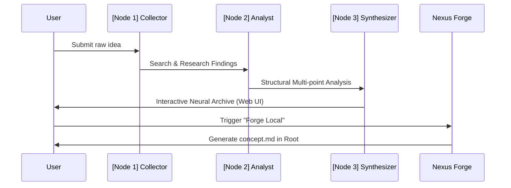
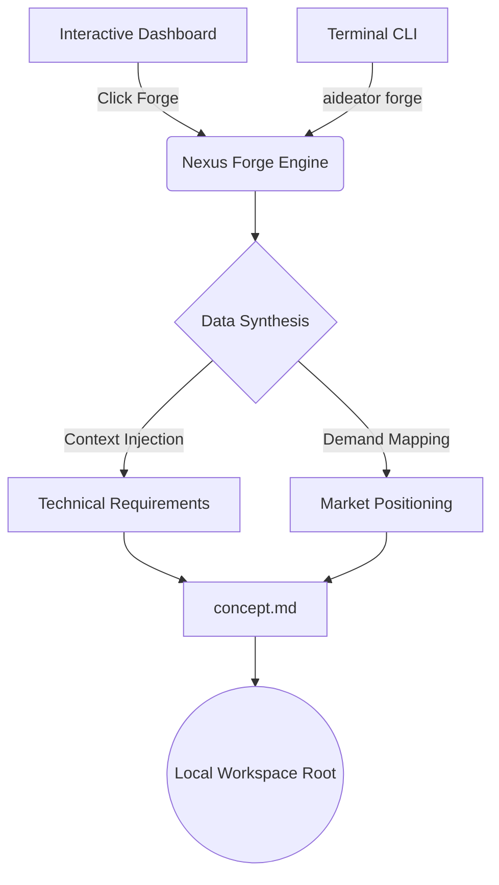

# AIdeator: Deployment & Intelligence Flows

Welcome to the **AIdeator** ecosystem. This document outlines the primary operational trajectories for developers, analysts, and operators.

---

## 1. Intelligence Architecture
AIdeator utilizes a **3-Node Intelligence Graph** to process raw ideas into actionable assets.



---

## 2. Core Operational Flows

### A. The CLI Ecosystem (Developer Mode)
The CLI is the heartbeat of AIdeator, designed for high-velocity iteration.

1. **Initialization**: Configure your neural providers and local storage.
   ```bash
   aideator config init
   ```
2. **Launch Neural Hub**: Fire up the interactive dashboard.
   ```bash
   aideator serve
   ```
3. **Artifact Forging**: Generate local documentation without leaving the terminal.
   ```bash
   aideator forge <idea_id>
   ```

### B. The Nexus Forge Workflow
A specialized bridge between abstract intelligence and concrete development.



---

## 3. Deployment Environments

### I. Local Python (Virtual Env)
Best for core development and engine modifications.
```bash
# Clone and Setup
git clone https://github.com/ARCHITECTURA-AI/AIdeator.git
cd AIdeator
python -m venv venv
source venv/bin/activate  # or venv\Scripts\activate on Windows

# Install and Serve
pip install -e .
aideator serve
```

### II. Docker (Containerized)
The recommended "Set and Forget" method for stability and isolation.
```bash
# Build & Up
docker-compose up --build
```
*Access via: `http://localhost:8000`*

---

## 4. Troubleshooting & Verification
Validate your installation with the built-in diagnostic suite:
```bash
# Run Health Check
python -m pytest tests/unit

# Rebuild Neural Documentation
aideator rebuild-docs
```

> [!TIP]
> Use the **Developer Mode** toggle in the Web UI (Idea Detail page) to access raw findings and triggers for the Nexus Forge asset generation.
